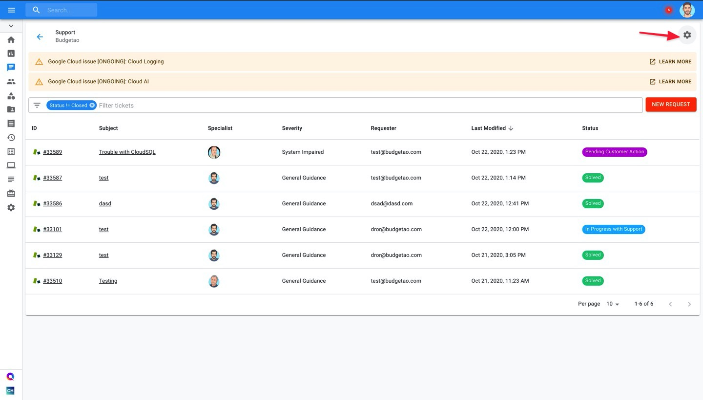
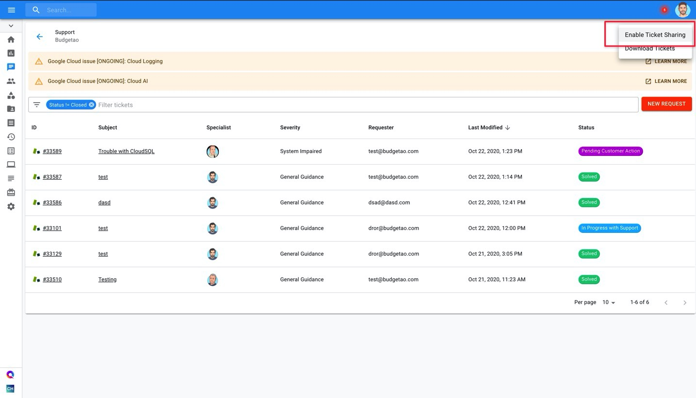

# Enable Ticket Sharing

Ticket sharing allows users to see all tickets, even if the ticket was opened by another user in the organization. This is useful if multiple people are opening support tickets and the organization would like to have visibility into all tickets.


Required Permissions: **Billing Profile Admin**


Start with navigating to the 'Support' page by selecting the icon on the left-hand side menu.

Locate the settings gear icon at the top-right of the page and click 'Enable Ticket Sharing'.

Once enabled, you will be able to see tickets opened by others in your organization.

