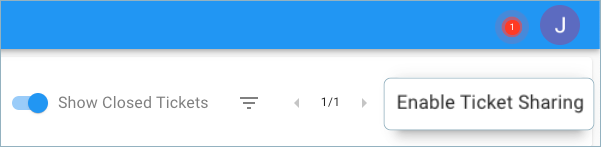
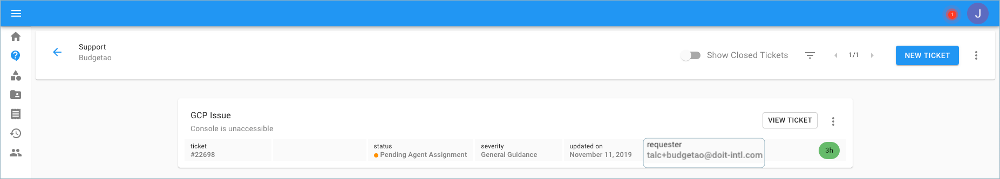

# Ticket Sharing

Ticket sharing allows users to see all tickets, even if the ticket was opened by another user in the organization. This is useful if multiple people are opening support tickets and the organization would like to have visibility into all tickets.

**Required Permissions:**

At a minimum, to enable/disable ticket sharing, you must be granted the following permissions:

* Billing Profile Admin

Start with navigating to the 'Support' page by selecting the icon on the left-hand side menu.

Locate the three-dots icon on the right-hand side of the page and click 'Enable Ticket Sharing'.

Below is an example of ticket sharing enabled, note the requester who opened the ticket.

