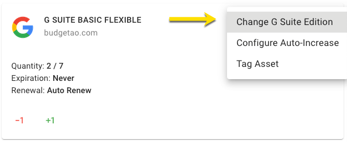
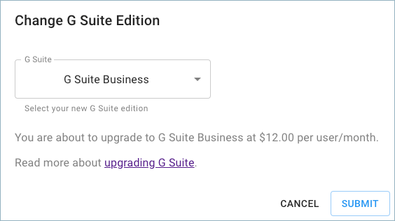
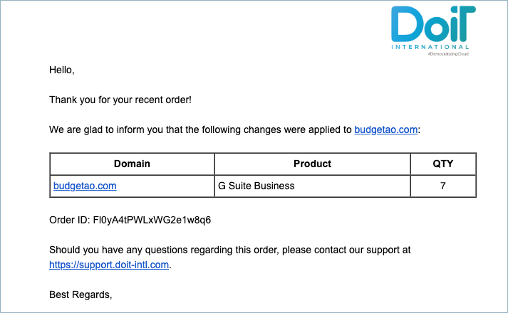

# Upgrading your G Suite Edition

As a customer, you are able to upgrade your G Suite subscription to get more business features and administrator controls.  

**Required Permission:**

At a minimum, to manage G Suite licenses, you must be granted the following permission:

* Licenses Manager

_Please note that you must be assigned access to the specific Billing Profile under which the domain is managed in order to upgrade your subscription._

From the main dashboard please select '**Manage Licenses & Assets**'.

Once you're at the Assets page, switch to the G Suite tab.

To upgrade to a higher edition, locate the G Suite subscription for which you want to upgrade, and click on the three-dots icon on the right-hand side of the widget. Then choose 'Change G Suite Edition'.

Upgrade options:

* G Suite Basic to Business or Enterprise edition
* G Suite Business to Enterprise edition

Select the G Suite edition you'd like to upgrade to, and click on 'Submit'.

An email notification confirming your recent order will be sent to you.

