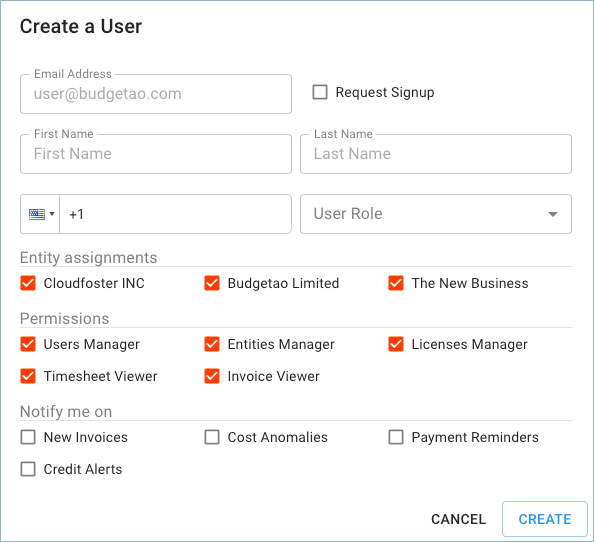

# Creating a New User

You can manage the access of other users on behalf of the organization, as well as create users for new employees who need access to the Cloud Management Platform.


Required Permissions: **User Manager**


Please select the '**Manage Users**' icon on the left-hand side of the page.

Fill in the Email, First & Last Name, Telephone and User Role of the employee you'd like to invite to your organization.

**Notifications:**

* _New Invoices_ - an email will be sent when a new invoice is uploaded to the Cloud Management Platform
* _Cost Anomalies_ - request to be notified when our system detects abnormal usage of your cloud platform \(i.e., AWS or Google Cloud\)
* _Payment Reminders_ - an email will be sent reminding the user to pay the invoice. There are three different instances of when notifications are sent:
  1. The first reminder is sent seven days before the invoice's due date
  2. The second reminder is sent four days after the invoice's due date
  3. The third reminder is sent 10 days after the invoice's due date
* _Credit Alerts_ - request to be notified when your credits are nearly exhausted and have been exhausted

